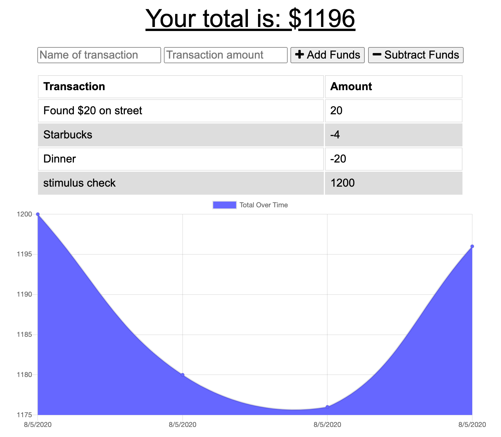

# Budget Tracker

  [](https://opensource.org/licenses/MIT)

## Description 

A Progressive Web Application for a user to add funds, subtract funds, and to view a graph of expense trends. This app is functional both online and offline and has the option to be installed.

The technologies used in this application are:
Node.js, Express, MongoDB, mongoose, morgan, compression, JavaScript, HTML, and CSS

See the URL for the deployed application: https://budget-tracker0820.herokuapp.com/
## Table of Contents

* [Installation](#installation)
* [Usage](#usage)
* [License](#license)

## Installation

- Run ```npm install``` in the command-line in order to install all of the dependencies required for the application

## Usage 

Use this application anytime you want to keep a budget whether you are online or offline

See the screenshots below of the running application:



## License

This application is covered under the MIT license.

## Questions

For any additional questions, please contact me:

------------------------------------------
## Jack Meier
#### GitHub: https://github.com/meierj423
#### E-mail: jackson.meier423@gmail.com